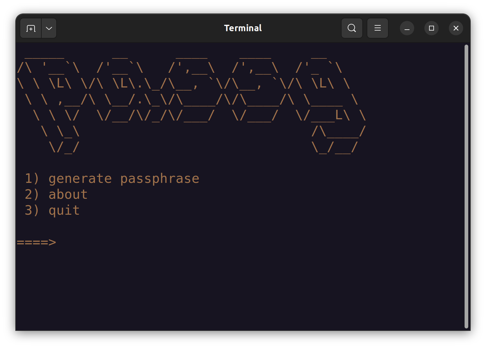

# Requeriments
+ Unix-based operating system like linux or mac. 

+ git

+ Python 3
## Installation
Install python
```
$ sudo apt install python3
```
[Download Python for mac](https://www.python.org/downloads/)

Clone the repository
```
git clone https://github.com/migueweb/passg
```
Move to directory
```
cd ./passg
```
Run passg
```
python3 passg.py
```

## Preview


## Create Aliases to passg
If you installed passg in your home directory you can paste this into your **.bashrc**
```
alias passg="cd ~ && cd passg && python3 passg.py"
```

You can now run passg from the terminal using the following command
```
passg
```
